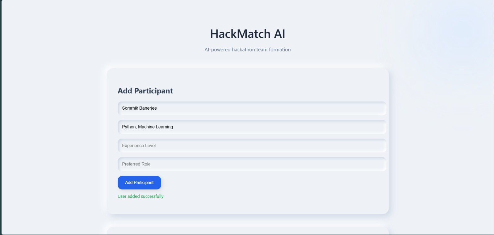
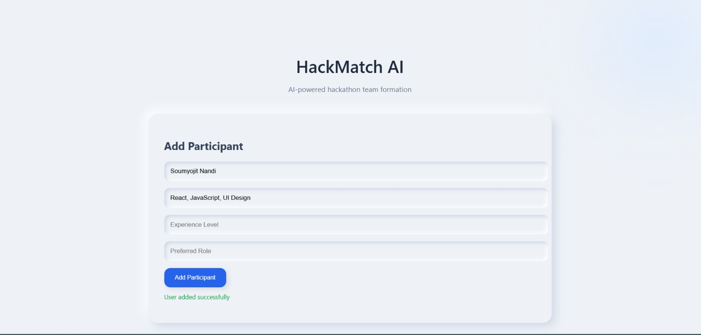
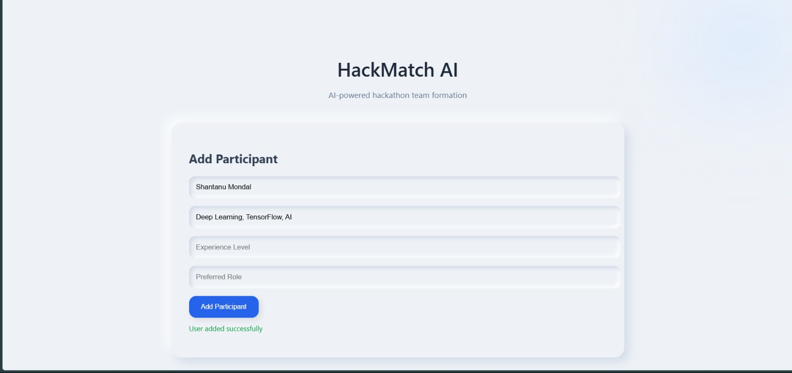
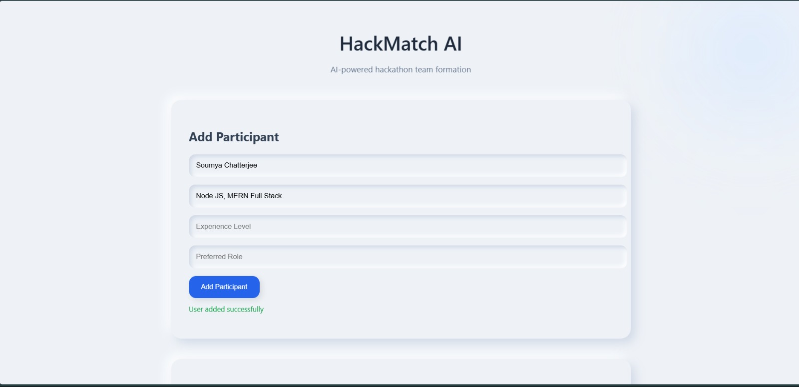
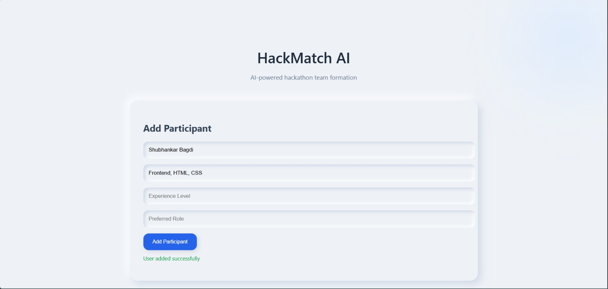
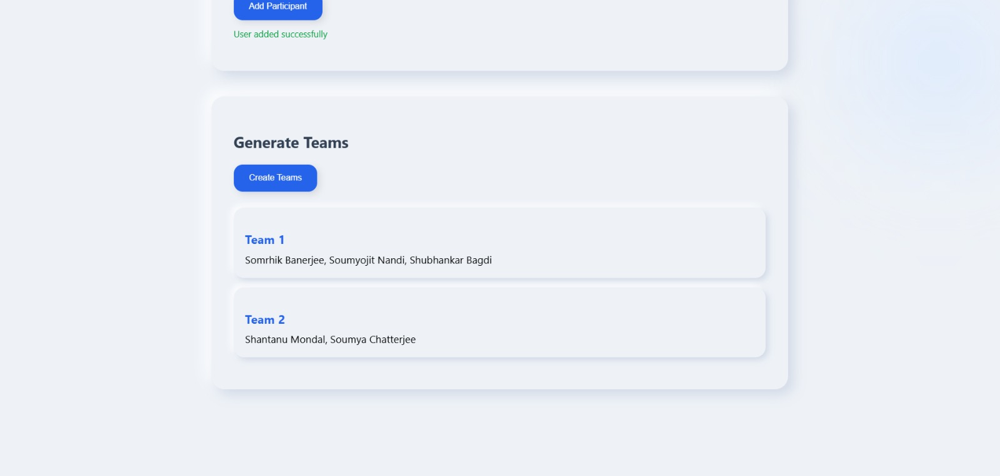

# 🚀 HackMatch AI

> AI-powered hackathon team formation system using semantic skill similarity and clustering.

HackMatch AI intelligently forms hackathon teams by analyzing participant skills using transformer-based embeddings and unsupervised clustering algorithms.

---

## ✨ Features

- 🔍 Semantic skill similarity matching  
- 🤝 Automatic team generation using KMeans clustering  
- ⚡ FastAPI backend with REST endpoints  
- 🎨 Modern responsive frontend (HTML, CSS, JS)  
- 📊 Compatibility scoring between participants  
- 🧠 Embedding-based skill analysis (Sentence Transformers)

---

## 📸 Application Preview

### 📝 Add Participants

<p align="center">
  
</p>

<p align="center">
  
</p>

<p align="center">
  
</p>

<p align="center">
  
</p>

<p align="center">
  
</p>

---

### 🤝 Team Generation

<p align="center">
  
</p>

## 🧠 How It Works

1. Participants enter:
   - Name
   - Skills
   - Experience level
   - Preferred role

2. Skills are converted into semantic embeddings using:

```

sentence-transformers/all-MiniLM-L6-v2

```

3. Embeddings are clustered using:

```

KMeans (scikit-learn)

```

4. Each cluster becomes a team.

---

## 🏗️ Tech Stack

- **Backend:** FastAPI  
- **Frontend:** HTML, CSS, JavaScript  
- **ML Model:** Sentence Transformers (MiniLM)  
- **Clustering:** Scikit-learn KMeans  
- **Language:** Python 3.10+

---

## 📂 Project Structure

```

hackmatch-ai/
│
├── backend/
│   ├── app/
│   │   ├── main.py
│   │   ├── matching.py
│   │   ├── models.py
│   │   └── database.py
│   │
│   ├── static/
│   │   ├── style.css
│   │   └── script.js
│   │
│   └── templates/
│       └── index.html
│
├── requirements.txt
└── README.md

```

---

## ⚙️ Installation

### 1️⃣ Clone Repository

```

git clone [https://github.com/YOUR_USERNAME/hackmatch-ai.git](https://github.com/YOUR_USERNAME/hackmatch-ai.git)
cd hackmatch-ai/backend

```

### 2️⃣ Create Virtual Environment

```

python -m venv venv
venv\Scripts\activate

```

### 3️⃣ Install Dependencies

```

pip install -r requirements.txt

```

### 4️⃣ Run Server

```

python -m uvicorn app.main:app --reload

```

Open in browser:

```

[http://127.0.0.1:8000/](http://127.0.0.1:8000/)

```

---

## 📊 API Endpoints

| Method | Endpoint        | Description |
|--------|-----------------|------------|
| POST   | `/add-user`     | Add participant |
| GET    | `/match-users`  | Calculate compatibility |
| GET    | `/form-teams`   | Generate teams |

---

## 🎯 Example Team Formation

If users enter:

- Python, Machine Learning  
- Deep Learning, AI  
- React, JavaScript  
- HTML, CSS  

The system automatically forms:

- Team 1 → AI/ML cluster  
- Team 2 → Frontend cluster  

Based on semantic similarity.

---

## 📌 Future Improvements

- Role-balanced team formation  
- Experience-level weighting  
- Admin dashboard  
- Database persistence  
- Deployment (Render / Railway)

---

## 📜 License

This project is for educational and academic use.
